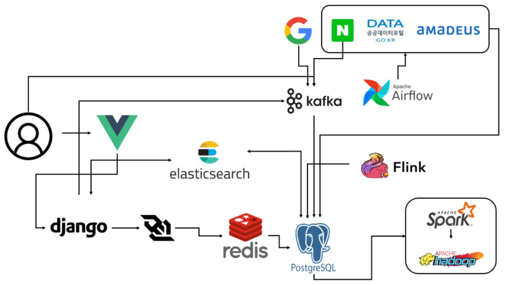
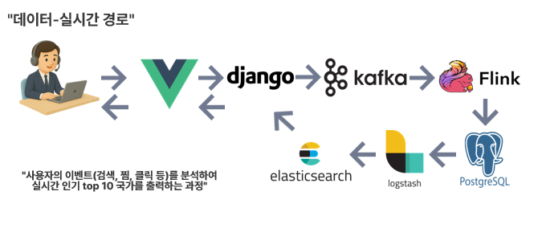
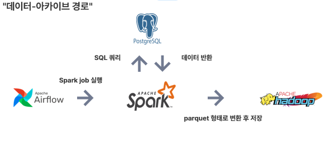
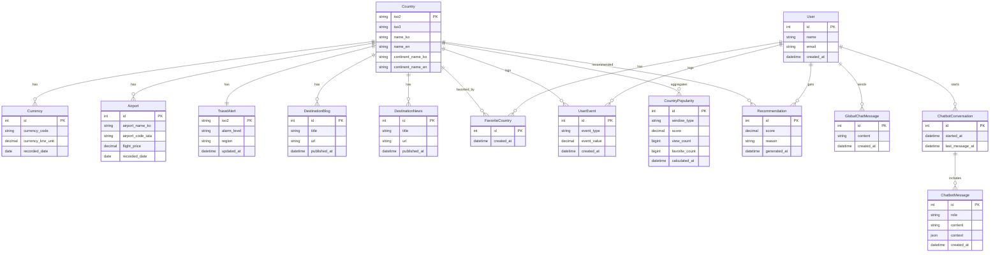

# TRAVEL_LENS

데이터 파이프라인과 검색/분석 스택을 결합한 여행 정보 플랫폼입니다. 실시간 인기·안전도·콘텐츠를 수집/분석하고, 지도 기반 UI에서 여행지를 탐색하며 AI 챗봇과 실시간 채팅으로 여행 결정을 돕습니다.

## 주요 기능
- 지도 기반 국가 탐색: 검색/클릭으로 국가 상세 이동, 인기/위험도 오버레이
- 여행 안전도/인기도: 사용자 행동 로그를 기반으로 실시간 지표 제공
- 콘텐츠 수집: 블로그/뉴스 자동 수집 및 검색 인덱싱
- 개인화: 즐겨찾기 국가 관리, 사용 로그 기반 추천 지표
- 실시간 커뮤니케이션: WebSocket 채팅
- AI Q&A: 여행 질문에 대한 챗봇 응답

## 시스템 구성
- Frontend: Vue 3 + MapLibre 기반 지도 UI
- Backend: Django/DRF + Channels(WebSocket) + Redis
- Data Pipeline: Kafka + Flink(실시간) + Airflow(배치) + Spark/HDFS(아카이브)
- Search/Analytics: Elasticsearch + Logstash + Kibana
- DB: PostgreSQL

## 스크린샷 & 아키텍처
아래 경로에 이미지 파일을 추가하면 README에서 바로 렌더링됩니다.

### 프로젝트 실행 영상
<video controls src="travellens _video.mp4" title="Title"></video>

### 아키텍처 다이어그램
#### 시스템 구조


#### 데이터-실시간 경로


#### 데이터-아카이브 경로

### ERD (Mermaid)


## API 엔드포인트
대표 엔드포인트만 요약했습니다. 상세는 `discription/backend_readme.md` 참고.

### 인증 (accounts)
- `POST /api/accounts/register/` 회원가입
- `POST /api/accounts/login/` 로그인
- `POST /api/accounts/logout/` 로그아웃
- `GET /api/accounts/profile/` 프로필 조회
- `PUT /api/accounts/profile/` 프로필 수정
- `POST /api/accounts/token/refresh/` 토큰 갱신

### 여행 정보 (travel)
- `GET /api/travel/countries/` 국가 목록
- `GET /api/travel/countries/{iso2}/` 국가 상세
- `GET /api/travel/countries/{iso2}/currency/` 환율
- `GET /api/travel/countries/{iso2}/airport/` 항공권 가격
- `GET /api/travel/countries/{iso2}/alert/` 여행 경보

### 콘텐츠 (content)
- `GET /api/content/blogs/` 블로그 목록
- `GET /api/content/blogs/{id}/` 블로그 상세
- `GET /api/content/news/` 뉴스 목록
- `GET /api/content/news/{id}/` 뉴스 상세

### 검색 (search)
- `GET /api/search/countries?q={keyword}` 국가 검색
- `GET /api/search/countries/suggest?q={keyword}` 자동완성
- `GET /api/search/blogs?q={keyword}&iso2={iso2}` 블로그 검색
- `GET /api/search/news?q={keyword}&iso2={iso2}` 뉴스 검색

### 사용자 상호작용 (interaction)
- `POST /api/interaction/logs/` 행동 로그 기록
- `GET /api/interaction/favorites/` 즐겨찾기 국가 목록
- `GET /api/interaction/countries/{iso2}/favorite/` 즐겨찾기 여부

### 채팅 (chat)
- `WS /ws/chat/global/?token={access_token}` 실시간 채팅

### 챗봇 (chatbot)
- `POST /api/chatbot/query/` AI Q&A

### 분석 (analytics)
- `GET /api/analytics/popular/` 인기 국가 TOP 10
- `GET /api/analytics/popular/?window_type=daily` 일간 인기
- `GET /api/analytics/popular/?window_type=monthly` 월간 인기

## 기술 스택
- Frontend: Vue 3, Pinia, Vite, MapLibre
- Backend: Django, DRF, SimpleJWT, Channels, Redis
- Data: Kafka, Airflow, Flink, Spark, HDFS, PostgreSQL
- Search: Elasticsearch, Logstash, Kibana
- Infra: Docker Compose

## 디렉터리 구조
- `front-pjt/` : 프론트엔드
- `backend-pjt/` : 백엔드 API 및 WebSocket
- `data-pipeline/` : 수집/ETL 파이프라인
- `elasticsearch/` : 검색 파이프라인 설정
- `discription/` : 상세 문서

## 실행 방법 (Docker)
1) 환경 변수 설정: 루트 `.env`에 DB/외부 API 키 설정
2) 서비스 기동

```bash
docker compose up --build
```

3) 백엔드 초기화 (최초 1회)

```bash
docker-compose exec backend python manage.py migrate
docker-compose exec backend python manage.py load_travel_seed
```

4) 접속
- Frontend: `http://localhost:5173`
- Backend API: `http://localhost:8000`
- Elasticsearch: `http://localhost:9200`
- Kibana: `http://localhost:5601`

## 실행 방법 (로컬 개발)
### Frontend
```bash
cd front-pjt/travel-front
npm install
npm run dev
```

### Backend
```bash
cd backend-pjt
python -m venv venv
venv\Scripts\activate
pip install -r requirements.txt
```

`.env` 예시 (backend-pjt/.env):
```bash
SECRET_KEY=your-secret-key
DEBUG=True
POSTGRES_DB=travellens
POSTGRES_USER=travellens
POSTGRES_PASSWORD=2049
POSTGRES_HOST=127.0.0.1
POSTGRES_PORT=5432
KAFKA_BOOTSTRAP_SERVERS=127.0.0.1:9092
ELASTICSEARCH_HOST=127.0.0.1
ELASTICSEARCH_PORT=9200
```

DB 마이그레이션/시드 로드 후 서버 실행:
```bash
python manage.py migrate
python manage.py load_travel_seed
python manage.py runserver
```

## 참고 문서
- `discription/backend_readme.md`
- `discription/data_readme.md`
