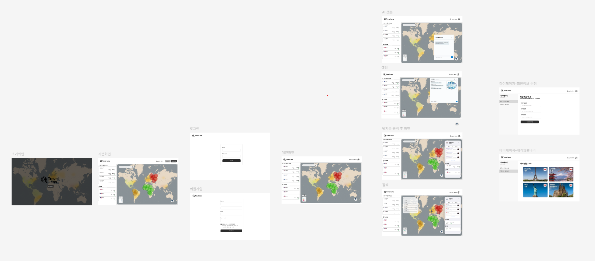
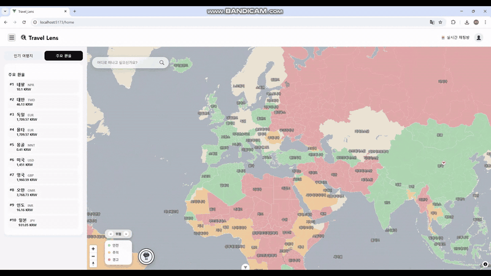
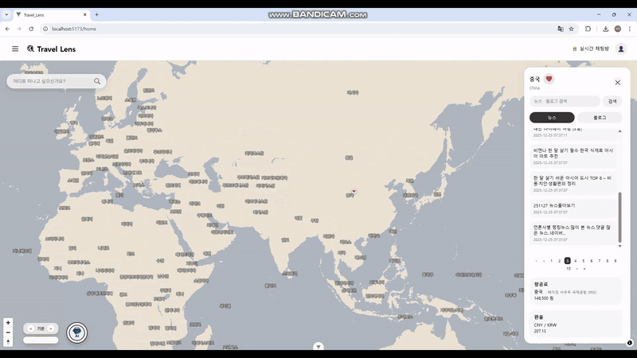
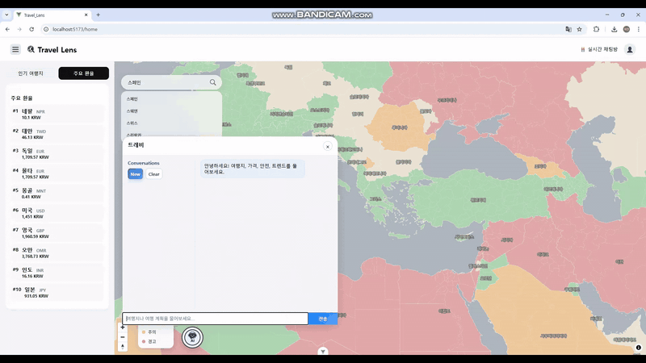
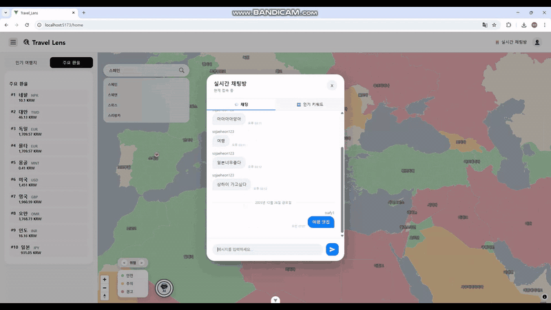
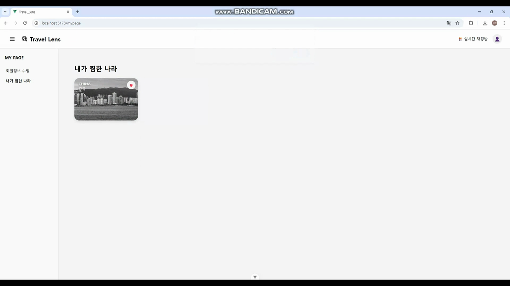
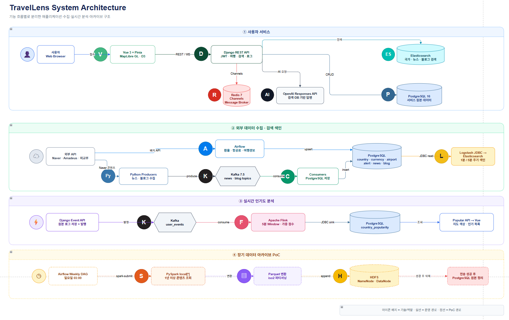
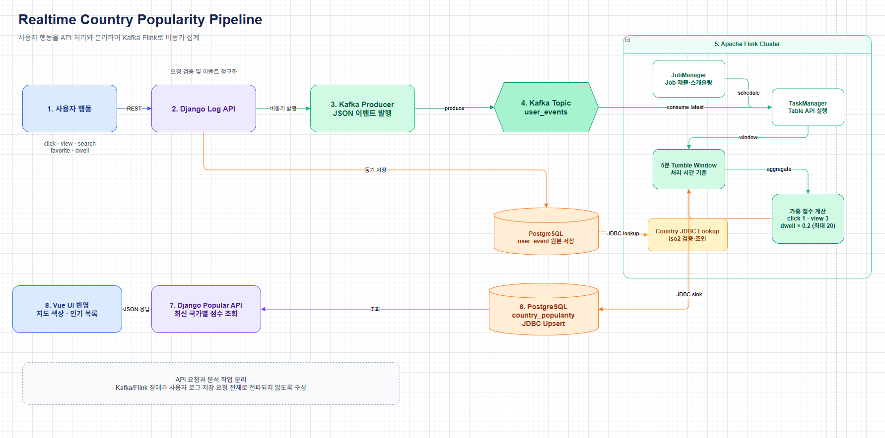
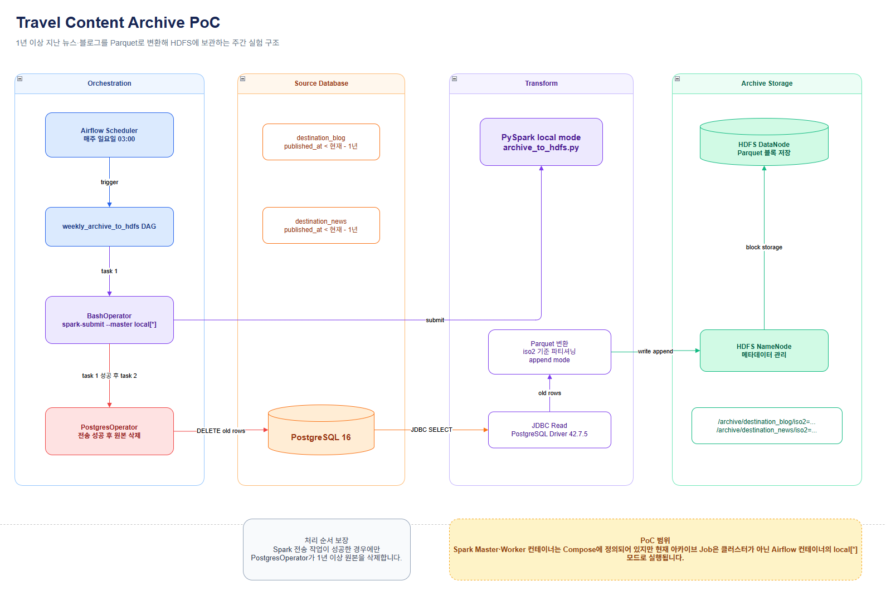
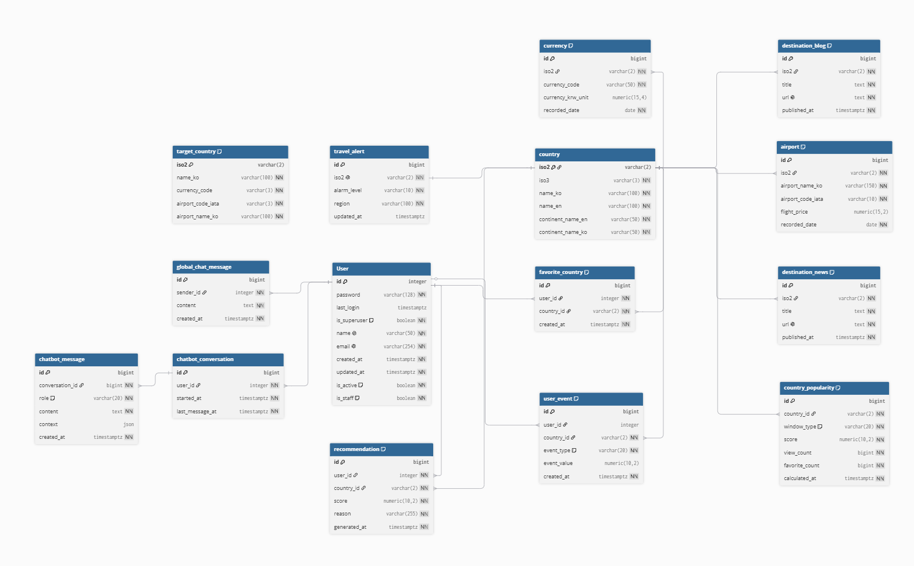

<div align="center">

# 🌍 TravelLens

### 데이터로 더 똑똑한 여행, AI로 더 완벽한 추천

여행지의 **인기 · 위험도 · 비용 · 최신 트렌드**를 세계지도에서 탐색하고,<br>
실시간 데이터와 AI를 활용해 여행지 선택을 돕는 여행 인사이트 플랫폼입니다.

[](./front-pjt/travel-front)
[](./backend-pjt)
[](./backend-pjt)
[](./data-pipeline/kafka)
[](./data-pipeline/flink)
[](./elasticsearch)
[](./docker-compose.yml)

[](./front-pjt/travel-front)
[](./data-pipeline/airflow)
[](./docker-compose.yml)
[](./data-pipeline/hdfs)
[](./data-pipeline/hdfs)
[](./backend-pjt/chatbot)

[`🎬 시연 영상`](#demo) · [`📐 설계 산출물`](#deliverables) · [`▶️ 실행 방법`](#run)

</div>

---

## 📑 목차

| 프로젝트 | 구현 | 기술·협업 |
| --- | --- | --- |
| [프로젝트 개요](#overview) | [핵심 기능](#features) | [기술 스택](#stack) |
| [문제와 해결](#problem) | [시스템 아키텍처](#architecture) | [팀 역할](#team) |
| [서비스 목업](#mockup) | [데이터 파이프라인](#pipeline) | [트러블슈팅](#troubleshooting) |
| [서비스 시연](#demo) | [ERD](#erd) | [API 명세](#api) |

<a id="demo"></a>
## 🎬 서비스 시연

<div align="center">

<video src="./travellens%20_video.mp4" controls width="100%">
  브라우저가 영상 재생을 지원하지 않습니다.
</video>

회원가입부터 지도 탐색, 콘텐츠 검색, 실시간 채팅, AI 여행 추천, 마이페이지까지 전체 흐름을 담았습니다.

</div>

> GitHub에서 플레이어가 표시되지 않는 경우 **[전체 시연 영상 열기](./travellens%20_video.mp4)**를 이용할 수 있습니다.

<a id="overview"></a>
## 📌 프로젝트 개요

TravelLens는 뉴스, 블로그, 환율, 항공권, 여행경보처럼 여러 플랫폼에 흩어진 여행 정보를 국가 단위로 통합합니다. 사용자는 세계지도에서 국가를 비교하고, 사용자 행동 데이터로 계산된 인기 여행지와 AI 기반 여행 답변을 확인할 수 있습니다.

| 구분 | 내용 |
| --- | --- |
| 개발 기간 | 2025.11 ~ 2025.12 · 6주 |
| 팀 구성 | 소재헌, 홍지은 · 2명 |
| 핵심 가치 | 지도 기반 탐색 · 실시간 인기도 · 통합 검색 · AI 여행 추천 |
| 주요 기술 | Vue, Django, PostgreSQL, Kafka, Flink, Elasticsearch, Airflow, PySpark |
| 협업 도구 | GitHub, Notion, Figma |

<a id="problem"></a>
## 💡 문제와 해결

| 문제 | TravelLens의 해결 방식 |
| --- | --- |
| 여행 정보가 여러 플랫폼에 분산됨 | 환율·항공권·여행경보·뉴스·블로그를 국가별로 통합 |
| 인기 여행지를 객관적으로 비교하기 어려움 | 사용자 행동을 Kafka와 Flink로 집계해 인기도 제공 |
| 최신 데이터를 반영한 여행 추천이 부족함 | Elasticsearch 검색 결과와 서비스 DB를 결합한 AI 챗봇 제공 |
| 목적지를 정하지 못하면 검색이 어려움 | 세계지도와 국가 자동완성을 결합한 탐색 경험 제공 |

<a id="mockup"></a>
## 🎨 서비스 목업

초기 화면부터 지도 탐색, 검색, 채팅, AI 챗봇, 마이페이지까지 전체 사용자 흐름을 설계했습니다.



<a id="features"></a>
## 🚀 핵심 기능

### 1. 🗺️ 지도 기반 여행 탐색

- MapLibre GL 기반 세계지도와 한글·영문 국가 검색
- 여행경보와 실시간 인기도를 국가별 색상으로 시각화
- 환율, 항공권, 뉴스, 블로그를 한 패널에서 제공



### 2. 🔥 실시간 여행 트렌드

- 클릭, 검색, 상세 조회, 체류 시간, 즐겨찾기 이벤트 수집
- Kafka 이벤트 전달과 Flink 5분 윈도우 집계
- 국가별 인기도 점수를 지도와 인기 목록에 반영


### 3. 🔎 여행 콘텐츠 수집과 검색

- Naver API 기반 국가별 뉴스·블로그 수집
- Kafka Producer·Consumer로 수집과 저장 단계 분리
- Logstash JDBC를 통한 PostgreSQL → Elasticsearch 색인
- Nori와 n-gram 기반 한글 검색 및 국가 자동완성



### 4. 🤖 AI 여행 추천

- Elasticsearch 뉴스·블로그와 PostgreSQL 여행 데이터를 결합
- 즐겨찾기와 최근 행동을 반영한 사용자별 컨텍스트 구성
- 대화 세션과 메시지 이력 저장



> 현재 AI 챗봇은 벡터 임베딩이 아닌 **키워드 검색과 정형 데이터 조회를 결합한 검색 증강 생성 방식**입니다.

### 5. 💬 커뮤니티와 개인화

- Django Channels·Redis 기반 글로벌 WebSocket 채팅
- D3 기반 실시간 채팅 워드클라우드
- 관심 국가 즐겨찾기와 마이페이지 관리





<a id="architecture"></a>
## 🏗️ 시스템 아키텍처

사용자 서비스, 외부 데이터 수집, 실시간 분석, 검색 색인, AI 응답, 아카이브 PoC를 기능 흐름별로 분리했습니다.



**[📐 draw.io 원본 보기](./docs/architecture/system-architecture.drawio)**

<a id="pipeline"></a>
## 🔄 데이터 파이프라인

### 실시간 인기도

사용자 행동은 Django에서 원본 로그로 저장한 뒤 Kafka `user_events` 토픽에 발행됩니다. Flink는 이벤트를 5분 윈도우로 집계하여 `country_popularity`에 저장하고, Vue는 최신 결과를 지도와 인기 목록에 반영합니다.



**[📐 draw.io 원본 보기](./docs/architecture/realtime-popularity-pipeline.drawio)**

### 콘텐츠 수집과 검색 색인

```text
Naver API → Kafka Producer → Kafka → Consumer → PostgreSQL
PostgreSQL → Logstash JDBC → Elasticsearch → Django Search API
```

국가 데이터는 5분마다, 뉴스·블로그는 1분마다 검색 인덱스로 동기화합니다.

### Spark·HDFS 데이터 아카이브

Airflow가 매주 일요일 새벽 3시에 PySpark Job을 실행합니다. PySpark는 PostgreSQL에서 1년 이상 된 뉴스·블로그를 JDBC로 읽고, `iso2` 기준 Parquet로 변환해 HDFS에 저장합니다. 전송 작업이 성공한 경우에만 PostgreSQL의 오래된 원본을 정리합니다.



**[📐 draw.io 원본 보기](./docs/architecture/data-archive-poc.drawio)**

> Spark Master·Worker와 HDFS NameNode·DataNode는 Docker Compose에 구성했습니다. 현재 아카이브 Job은 분산 클러스터가 아닌 Airflow 컨테이너의 `local[*]` 모드로 실행되는 PoC입니다.

<a id="erd"></a>
## 🗃️ ERD

국가를 중심으로 환율·항공권·여행경보·콘텐츠·인기도를 연결하고, 사용자 행동·추천·채팅·챗봇 대화를 별도 도메인으로 구성했습니다.



`target_country`는 환율과 항공 데이터의 수집 대상을 관리하는 독립 기준 테이블입니다.

<a id="stack"></a>
## 🛠️ 기술 스택

| 영역 | 기술 | 역할 |
| --- | --- | --- |
| Frontend | Vue 3, Pinia, Vue Router, MapLibre GL, D3 | UI, 상태 관리, 지도, 워드클라우드 |
| Backend | Django 5.2, DRF, SimpleJWT | REST API, 인증, 도메인 로직 |
| Realtime | Django Channels, Redis | WebSocket 채팅 |
| Database | PostgreSQL 16 | 서비스 원본 데이터와 집계 결과 저장 |
| Streaming | Kafka 7.5, Flink 1.18 | 이벤트 전달과 실시간 인기도 집계 |
| Search | Elasticsearch 8.17, Logstash, Nori | 한글 검색과 검색 인덱스 동기화 |
| Workflow | Airflow | 외부 여행 데이터 수집과 아카이브 스케줄링 |
| Batch·Archive | PySpark, Hadoop HDFS, Parquet | 오래된 콘텐츠 변환과 장기 보관 PoC |
| AI | OpenAI Responses API | 서비스 데이터 기반 여행 답변 생성 |
| Infrastructure | Docker Compose | 애플리케이션과 데이터 인프라 통합 실행 |

### 기술 선택 기준

| 기술 조합 | 선택 이유 |
| --- | --- |
| Kafka + Flink | API 요청과 분석 작업을 분리하고 행동 이벤트를 시간 단위로 집계 |
| PostgreSQL + Elasticsearch | 원본 저장과 검색 책임을 분리하고 한글 검색 품질 확보 |
| Channels + Redis | REST와 분리된 양방향 채팅 및 메시지 브로드캐스트 구현 |
| Airflow + PySpark + HDFS | 오래된 콘텐츠의 주기적 변환·보관 구조 검증 |
| Elasticsearch + OpenAI | 최신 검색 결과와 정형 데이터를 근거로 AI 답변 생성 |

<a id="team"></a>
## 👥 팀 역할

| 팀원 | 담당 영역 | 핵심 구현 |
| :---: | --- | --- |
| **소재헌** | 서비스·프론트엔드 | 전체 UI/UX, 인증, 세계지도, 국가 상세, 인기 여행지, AI 챗봇 화면 |
|  | 백엔드·사용자 로그 | Django 모델·API, JWT, 행동 로그 저장, Kafka 이벤트 발행 |
|  | 실시간 인기도 | PyFlink 초기 집계 Job, 인기도 API, 지도·목록 시각화 |
|  | 검색·AI·인프라 | Elasticsearch·Logstash, AI 챗봇, Docker Compose 통합 |
| **홍지은** | 여행 데이터 수집 | 뉴스·블로그·환율·항공권·여행경보 수집, Airflow DAG, Kafka Producer·Consumer |
|  | 실시간 처리 | Flink Table API 기반 집계 로직과 Kafka 연결 보완 |
|  | 커뮤니티·개인화 | Channels·Redis 채팅, D3 워드클라우드, 즐겨찾기 마이페이지 |
|  | 데이터 아카이브 | PySpark·HDFS 기반 장기 아카이브 PoC |

### 공동 작업

| 기능 | 협업 내용 |
| --- | --- |
| 실시간 인기도 | 사용자 로그·Kafka 발행·Flink 집계·화면 반영을 공동 연결 |
| 데이터 파이프라인 | 외부 수집 코드를 Django 모델과 Docker Compose 환경에 통합 |
| 즐겨찾기 | 좋아요 저장·토글 API와 마이페이지 조회 화면 연결 |
| 실시간 채팅 | Channels·Redis 서버와 Vue 채팅 UI 통합 |

<a id="troubleshooting"></a>
## 🧯 트러블슈팅

### 사용자 요청과 실시간 분석 분리

**문제:** API 요청 안에서 분석까지 처리하면 응답 지연과 장애 전파 가능성이 있었습니다.

**해결:** Django는 행동 로그 저장과 Kafka 발행만 담당하고, Flink가 별도 프로세스로 집계하도록 분리했습니다.

### 최신 데이터와 LLM의 시점 차이

**문제:** LLM 단독 응답은 최신 환율·항공권·여행경보와 사용자 관심 정보를 알 수 없었습니다.

**해결:** Elasticsearch 검색 결과와 PostgreSQL 최신 데이터를 구조화된 컨텍스트로 전달해 서비스 데이터에 근거한 답변을 생성했습니다.

### 원본 저장소와 검색 인덱스 분리

**문제:** PostgreSQL의 단순 문자열 검색만으로 한글 자동완성과 콘텐츠 관련도를 처리하기 어려웠습니다.

**해결:** PostgreSQL을 원본 저장소로 유지하고 Logstash JDBC와 Elasticsearch Nori·n-gram 분석기로 검색 계층을 분리했습니다.

<a id="api"></a>
## 📘 API 명세

**Base URL:** `http://localhost:8000`

인증이 필요한 API는 다음 헤더를 사용합니다.

```http
Authorization: Bearer {access_token}
```

<details>
<summary><strong>인증 API</strong></summary>

| Method | Endpoint | 인증 | 요청·응답 |
| --- | --- | :---: | --- |
| `POST` | `/accounts/register/` | - | 요청: `email`, `name`, `password` · 응답: 가입 완료 메시지 |
| `POST` | `/accounts/login/` | - | 요청: `email`, `password` · 응답: `access`, `refresh`, `user` |
| `POST` | `/accounts/refresh/` | - | 요청: `refresh` · 응답: 새 `access` 토큰 |
| `POST` | `/accounts/change-password/` | 필요 | 요청: `old_password`, `new_password`, `new_password_confirm` |

</details>

<details>
<summary><strong>여행 정보 API</strong></summary>

| Method | Endpoint | Query | 설명 |
| --- | --- | --- | --- |
| `GET` | `/travel/insights/country` | `iso2=JP` | 최신·이전 환율과 항공료, 여행경보를 국가별로 조회 |
| `GET` | `/travel/alerts` | - | 전체 국가 여행경보 조회 |
| `GET` | `/travel/exchange` | `limit=10` | 최신 환율과 이전 기록 대비 변동값 조회 |

`/travel/insights/country` 주요 응답 필드는 `iso2`, `fx`, `flight`, `alert`입니다.

</details>

<details>
<summary><strong>검색 API</strong></summary>

| Method | Endpoint | Query | 설명 |
| --- | --- | --- | --- |
| `GET` | `/search/countries/` | `q`, `size=10` | 한글·영문 국가 검색 |
| `GET` | `/search/autosearch/` | `q`, `size=5` | 국가명 자동완성 |
| `GET` | `/search/news/` | `q`, `iso2`, `page=1`, `size=10` | 뉴스 검색과 국가 필터링 |
| `GET` | `/search/blogs/` | `q`, `iso2`, `page=1`, `size=10` | 블로그 검색과 국가 필터링 |

뉴스·블로그 검색은 `results`와 페이지 정보를 반환하며, 각 결과에는 제목·원문 URL·발행일·국가 코드가 포함됩니다.

</details>

<details>
<summary><strong>사용자 행동·즐겨찾기·인기도 API</strong></summary>

| Method | Endpoint | 인증 | 요청·응답 |
| --- | --- | :---: | --- |
| `POST` | `/interaction/logs/` | 선택 | 요청: `event_type`, `country_code`, `value` · 저장 후 Kafka 발행 |
| `GET` | `/interaction/countries/{iso2}/favorite/` | 필요 | 응답: `is_favorited` |
| `GET` | `/interaction/favorites/` | 필요 | 응답: 즐겨찾기 `count`, `results` |
| `GET` | `/analytics/popular/` | - | Query: `limit=5`, `window_type=hourly` · 인기 국가 순위 |
| `GET` | `/analytics/popularity/map/` | - | Query: `window_type=hourly` · 지도 색상용 국가별 점수 |

행동 이벤트는 `country_click`, `country_search_select`, `country_detail_open`, `country_detail_stay`, `country_like_toggle`을 지원합니다. 좋아요 이벤트는 로그인 사용자의 즐겨찾기를 함께 토글합니다.

</details>

<details>
<summary><strong>AI 챗봇 API</strong></summary>

| Method | Endpoint | 인증 | 요청·응답 |
| --- | --- | :---: | --- |
| `POST` | `/chatbot/query/` | 선택 | 요청: `message`, `country_iso2`, `conversation_id` · 응답: `answer`, `context`, `conversation_id` |
| `GET` | `/chatbot/history/` | 필요 | Query: `conversation_id` · 응답: 대화 메시지 목록 |
| `GET` | `/chatbot/conversations/` | 필요 | 대화 세션 목록과 첫 질문 미리보기 |
| `DELETE` | `/chatbot/conversations/{id}/` | 필요 | 지정한 대화 세션 삭제 |
| `DELETE` | `/chatbot/conversations/clear/` | 필요 | 사용자의 전체 대화 세션 삭제 |

챗봇 `context`에는 국가, 여행경보, 환율, 항공료, 뉴스, 블로그, 인기 여행지와 로그인 사용자의 즐겨찾기·최근 행동이 포함될 수 있습니다.

</details>

<details>
<summary><strong>실시간 채팅 API</strong></summary>

| Protocol | Endpoint | 인증 | 설명 |
| --- | --- | :---: | --- |
| `GET` | `/api/chat/history/` | - | 저장된 글로벌 채팅 메시지 조회 |
| `WS` | `/ws/chat/global/?token={access_token}` | 선택 | 글로벌 실시간 채팅 연결 |

WebSocket 연결은 JWT 쿼리 토큰을 사용할 수 있으며, Redis Channel Layer를 통해 메시지를 브로드캐스트합니다.

</details>

로컬 실행 후 [`Swagger`](http://localhost:8000/swagger/)와 [`ReDoc`](http://localhost:8000/redoc/)에서도 전체 스키마를 확인할 수 있습니다.

<a id="deliverables"></a>
## 📐 설계 산출물

| 산출물 | 설명 | 문서 |
| --- | --- | --- |
| 서비스 목업 | 주요 화면과 사용자 흐름 | [이미지](./docs/design/service-mockup.png) |
| 시스템 아키텍처 | 서비스·수집·처리·검색·AI 전체 구성 | [이미지](./docs/architecture/travelLens_system_Architecture.png) · [draw.io](./docs/architecture/system-architecture.drawio) |
| 최종 ERD | 실제 Django 모델 기준 데이터 관계 | [이미지](./docs/ERD/travelLens_ERD.png) · [DBML](./docs/ERD/final-erd.dbml) |
| API 명세 | 백엔드 API 요청·응답 | [README에서 보기](#api) |
| 실시간 처리 설계 | Kafka·Flink 인기도 집계 | [이미지](./docs/architecture/travelLens_data_pipeline.png) · [draw.io](./docs/architecture/realtime-popularity-pipeline.drawio) |
| 데이터 아카이브 | Airflow·PySpark·HDFS PoC | [이미지](./docs/architecture/travel_content_archive_PoC.png) · [draw.io](./docs/architecture/data-archive-poc.drawio) |

## 📁 프로젝트 구조

```text
travel_lens/
├─ front-pjt/travel-front/     # Vue 프런트엔드
├─ backend-pjt/                # Django API, WebSocket, AI 챗봇
├─ data-pipeline/
│  ├─ airflow/                 # 정기 수집과 아카이브 DAG
│  ├─ kafka/                   # 콘텐츠·사용자 이벤트 전달
│  ├─ flink/                   # 실시간 인기도 집계
│  └─ hdfs/                    # PySpark 아카이브 PoC
├─ elasticsearch/
│  ├─ index/                   # 검색 인덱스 정의
│  └─ pipeline/                # Logstash JDBC 파이프라인
├─ docs/                       # README 이미지와 설계 산출물
└─ docker-compose.yml          # 전체 서비스 실행 환경
```

<a id="run"></a>
## ▶️ 실행 방법

`.env`에 PostgreSQL과 외부 API 접속 정보를 설정한 뒤 실행합니다.

```bash
docker compose up --build
```

| 서비스 | 주소 |
| --- | --- |
| Frontend | `http://localhost:5173` |
| Backend | `http://localhost:8000` |
| Swagger | `http://localhost:8000/swagger/` |
| Airflow | `http://localhost:8080` |
| Spark Master | `http://localhost:8081` |
| Spark Worker | `http://localhost:8082` |
| Flink | `http://localhost:8084` |
| Elasticsearch | `http://localhost:9200` |
| Kibana | `http://localhost:5601` |
| HDFS NameNode | `http://localhost:9870` |

## 🚧 한계 및 개선 계획

- Elasticsearch 벡터 검색을 추가한 하이브리드 RAG 적용
- Logstash 뉴스·블로그 증분 색인 설정 보완
- Django API와 데이터 파이프라인 테스트 자동화
- 개발·운영 환경 설정과 보안 값 분리
- Spark·HDFS PoC를 실제 분산 실행 구조로 전환

## 📝 회고

TravelLens를 통해 REST API뿐 아니라 데이터 수집, 실시간 처리, 검색, WebSocket, AI 답변 생성까지 하나의 서비스 흐름으로 연결했습니다. 여러 기술을 사용하는 것보다 PostgreSQL, Kafka, Elasticsearch, Flink 등 각 기술의 책임과 경계를 명확히 나누는 것이 중요하다는 점을 배웠습니다.
